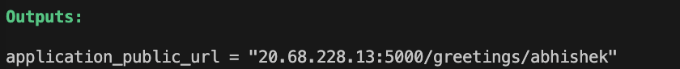

# Introduction 
This repository contains Terraform code for setting up a basic Azure infrastructure.

We have 2 logical segregation of the terraform code as below:

1. bootstrap directory:

   Contains terraform code for provisioning Resource Group, Storage account, Virtual Network and associated networking resources.

   Bootstrap Infrastructure refers to the essential infrastructure resources that are necessary during the initial provisioning phase and ideally remains unchanged or require infrequent modifications.

2. application-infra directory: 

   Contains terraform code for provisioning a VM & associated infrastructure components for deploying a simple application.

   Application infrastructure refers to any infrastructure that we will use for deploying and running the application.

## Setting up your workstation

- Fork this repository into your personal Github account and clone it locally
- Choose your preferred IDE (VSCode or IntelliJ) and open the `azure-terraform-workshop` codebase
- Install Terraform Plugin
- Install [TFEnv](https://github.com/tfutils/tfenv) and ensure you have Terraform `1.5.0` version installed.
  It's recommended that we lock the terraform version.
  > Note: Demo what will happen when developers uses different version of terraform cli.

## Setting Up Bootstrap Infrastructure

### What resources are considered as Bootstrap?

In case of Azure where we already have a subscription and a user to provision the initial resources we may consider Resource Group, Storage Account and Service Principle as the bare minimal resources.

In cases where the Software Engineering Teams relies on Central Teams (Platform Engineers etc) for provisioning network infrastructure, Virtual Network and associated networking resources can also be considered as bootstrap infrastructure where hardening of the network is managed by SMEs.

### Provisioning Bootstrap Infrastructure

- Update Subscription id
  
  Replace Azure subscription id place holder configured in the `./bootstrap/terraform.tfvars` and `./application-infra/terraform.tfvars` files with your personal azure subscription id.

  ```
  subscription_id                              = "xxxxxxxxxxxxxxxxxxxxxxxxx"
  ```
  <b>Do not skip this step else Terraform wont work for you.</b>

- Authenticate Azure CLI by running below command from the terminal

  ```
  az login
  ```

- From the terminal change the directory
  ```bash
  cd bootstrap
  ```

- Initialize Terraform
  ```bash
  terraform init
  ```

- Plan the Terraform changes and review
  ```bash
  terraform plan
  ```

- Apply changes after its reviewed
  ```bash
  terraform apply
  ```

- Update all the reference of the storage account

  Since the storage account name needs to be globally unique we are using a random id generator for the storage account name.

  Search the entire codebase for the storage account name referenced as `aztfworkshopsa65` and replace with the newly created storage account name.

  Below files should be updated:

    - azure-pipelines.yml
    - bootstrap/backend-config.hcl
    - application-infra/backend-config.hcl
    - application-infra/terraform.tfvars

- Re Initialize Terraform to use a remote backend

  It's highly recommended to use terraform backend for storing terraform state files. [Click Here](https://developer.hashicorp.com/terraform/language/settings/backends/configuration) to learn more about TF backend.
  
  Uncomment `# backend "azurerm" {}` at line number 3 in the [./bootstrap/main.tf](./bootstrap/main.tf) file.

  Then execute below command and when prompted respond as `yes`:

  ```bash
  terraform init -backend-config=./backend-config.hcl 
  ```

  Once successfully executed the local `terraform.state` file has been securely stored in the Azure Storage Account.


### Provisioning Application Infrastructure

In our scenario we would like to provision a small Ubuntu VM and using the `azurerm_virtual_machine_extension` deploy a [Hello World Python Application](https://github.com/abhisheksr01/zero-2-hero-python-flask-microservice) to our newly created VM.

- From the terminal change the directory
  ```bash
  cd application-infra
  ```

- Initialize Terraform
  ```bash
  terraform init -backend-config=./backend-config.hcl
  ```

- Plan the Terraform changes and review
  ```bash
  terraform plan
  ```

- Apply changes after its reviewed
  ```bash
  terraform apply
  ```

  Once successfully executed you will see an `application_public_url` in the console output. Use the URL to access the application deployed in your newly provisioned VM.

  

> Note: If you are running behind a Corporate proxy, VPN or firewall it's highly likely that access to the IP based URL's might be blocked.

### Destroying Infrastructure

  <b>Always make sure that you destroy the infrastructure (only while learning or practicing) at the end of the exercise to ensure you are not paying for left over resources.</b>

  - Destroy `application-infra` resources
    
    From the application-infra directory execute below command and when prompted respond as `yes`:

    ```
    terraform destroy
    ```

    alternatively you can use below command without prompt
    ```
    terraform destroy --auto-approve
    ```

  - Destroy `bootstrap` resources
  
    From the bootstrap directory execute below command and when prompted respond as `yes`:
    ```
    terraform destroy
    ```
    alternatively you can use below command without prompt
    ```
    terraform destroy --auto-approve
    ```

    > You may get an error while trying to delete the bootstrap infrastructure because the storage account do not exist anymore where terraform was storing the remote state. Hence go to the portal and manually delete the leftover resources.

### Setting Up Azure DevOps Pipeline
    [Work in Progress]

- Login to Azure DevOps and create a separate project for you ex: `azure-terraform-workshop`
- Go to "Project Settings" and either create a new Service Principle or Setup an existing to be used by the pipeline
- Ensure the SPN has sufficient privileges to deploy the infrastructure as above.
- Go to pipeline section and select "Github" as your preferred repository.
- Select your forked version of this repository and use the `azure-pipeline.yaml` for setting up this pipeline.
- Once configure click "Run".
- Review the pipeline for any possible issues.

## terraform-best-practices
An opinionated attempt to bring Terraform Best practices under a single umbrella.

### Terraform Best Practices - 101

- Use Version Control
- TF Bootstrap
- Organize Your Code
- Use Variables
- Use Output Values
- Use Modules
- Use Terraform Backend
- Use Terraform Workspaces
- Use Terraform Provider Versioning
- Plan and Apply Separately

### Advance Best Practices

- Use Terraform Modules Wisely
- Use Remote State Sharing
- Automate Workflows with CI/CD
- Implement Security Measures
- Implement Infrastructure Testing
- Implement Infrastructure Drift Detection
- Leverage Remote Execution
- Monitor and Alert on Infrastructure Changes
- Implement a Disaster Recovery Plan
- Regularly Update Terraform Versions

### Terraform Security Best Practices

- Use Least Privilege Principle
- Secure Sensitive Information
- Protect Terraform State
- Apply Regular Updates
- Validate External Modules
- Practice Pair Programming
- Enable Logging and Monitoring
- Enable Two-Factor Authentication (2FA)
- Regularly Audit and Review Resources
- Educate and Train Your Team

### Terraform Tools & Utilities

- Terraform Validate
- Terraform Graph
- Terraform fmt
- TFLint
- TFsec
- Terrascan
- Terraform Compliance
- Terraform Vulnerability scanning
- Use AWS Nuke for Ephemeral Environments
